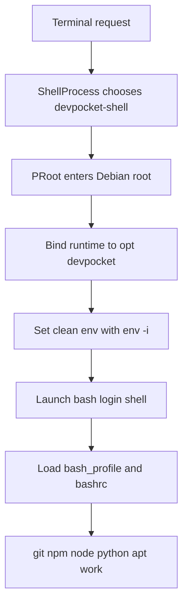

# Debian terminal completion plan

## Mission

Finish the Debian terminal implementation so the in-app terminal behaves like a laptop shell inside Debian.

Success means:
- terminal sessions launch into Debian every time
- there is no Android host shell fallback in the user path
- `git`, `node`, `npm`, `npx`, `python3`, and `apt` are usable from the Debian terminal
- HTTPS operations work with the bundled CA bundle
- existing installs receive the new runtime payload after upgrade

This plan is intentionally narrow. It does not redesign onboarding, package UI, or backend placement beyond what is required to finish the terminal.

---

## Repo review summary

### Already correct enough and should be preserved

1. Terminal selection logic is already Debian-aware in `packages/terminal/src/node/shell-process.ts` and prefers `devpocket-shell` when `DEVPOCKET_DEBIAN_ROOT` is present.
2. `packages/terminal/src/node/shell-terminal-server.ts` already forwards `DEVPOCKET_*`, locale, and terminal capability variables into terminal creation.
3. `packages/process/src/node/terminal-process.ts` already removed the noisy `stty` resize injection from the Android pipe fallback.
4. `android-app/android/app/src/main/java/com/theia/mobile/TheiaBackendService.kt` already uses host `resolvedShell` for `npm_config_script_shell` and `npm_config_shell`, which is the correct direction for backend-side npm lifecycle scripts.
5. `android-app/android/app/src/main/java/com/theia/mobile/AssetExtractor.kt` already contains the executable-bitness logic for `git-core`, `proot`, `bash.real`, and `python3`.

### Still broken or incomplete

1. `products/theia-android-lite/scripts/build-runtime-assets.mjs` now bundles only `node`, `bash`, and `bash.real` from Termux. That removed the toolchain the Debian terminal needs.
2. The build script does not copy npm's `lib/node_modules`, so `npm` and `npx` cannot run even if the wrapper scripts are present.
3. The build script does not copy `libexec/git-core`, resolve its symlinks, or normalize Termux shebangs.
4. `android-app/android/app/src/main/java/com/theia/mobile/BootstrapInstallerService.kt` still writes a `devpocket-shell` wrapper that enters Debian without bind-mounting the runtime into Debian.
5. The wrapper still has an Android fallback shell path. That directly conflicts with the Debian-first goal.
6. The Debian user shell files do not yet export `/opt/devpocket/bin`, `GIT_EXEC_PATH`, SSL variables, or npm settings.
7. `AssetExtractor.kt` is already at marker `v20`, so another runtime payload change now requires a fresh marker bump or upgrades will not re-extract.

---

## What changed after commit `5db9e0c36234e0bc3dbb412b1776a4dad005f7d0`

### Regressions introduced by that commit path

1. Runtime assembly stopped copying the full Termux toolchain and moved to a minimal host-only bundle.
2. The terminal plumbing began routing through Debian, but the runtime binaries were never made visible inside Debian.
3. The wrapper script kept a host fallback, which masked Debian breakage instead of forcing a real fix.

### Improvements made after that commit and already present now

1. `AssetExtractor.kt` was advanced to `v20` and now marks `git-core` files executable.
2. `TheiaBackendService.kt` already corrected npm shell config to use the host shell instead of the Debian wrapper.
3. `BootstrapInstallerService.kt` already contains Debian apt and dpkg compatibility scripts that should remain in place.

### Conclusion

The current repo is partially repaired. The remaining work is concentrated in runtime assembly and the Debian wrapper environment, not in the TypeScript terminal plumbing.

---

## Locked decisions for implementation

1. Debian remains the only supported user-facing terminal environment.
2. `devpocket-shell` must fail hard if Debian or `proot` is missing. No Android host fallback in the wrapper.
3. The Theia backend stays on the Android host for now.
4. The Debian terminal gets host-provided Termux binaries via bind mounts under `/opt/devpocket`.
5. We do not install developer packages during onboarding. We only make the terminal capable of running the mounted toolchain and Debian package manager.
6. We do not reintroduce any custom `git-remote-https` wrapper. Git helpers must remain real binaries or real copied helper files.
7. Existing TypeScript terminal routing stays untouched unless post-implementation verification proves a hidden dependency.

---

## Target runtime model



---

## Exact execution plan for Haiku

### Workstream 1: restore runtime payload assembly

**Primary file:** `products/theia-android-lite/scripts/build-runtime-assets.mjs`

#### Required changes

1. Expand the essential runtime binary list beyond host `node` and shell binaries.
2. Copy these binaries at minimum:
   - `node`
   - `bash`
   - `bash.real`
   - `git`
   - `npm`
   - `npx`
   - `python3`
   - `python3.real`
3. Copy npm runtime modules into `runtime/bin/lib/node_modules` so the Termux `npm` and `npx` wrappers resolve correctly.
4. Copy `libexec/git-core` into `runtime/bin/libexec/git-core`.
5. Resolve all symlinks under copied `git-core`, because Android assets do not preserve symlinks.
6. Normalize Termux shebangs under copied shell and script helpers:
   - Termux `sh` to `/bin/sh`
   - Termux `bash` to `/bin/bash`
   - Termux `perl` to `/usr/bin/perl`
   - Termux `python` to `/usr/bin/python3`
7. Add `readFileSync` to the top-level fs import and implement a synchronous `fixTermuxShebangs` helper.
8. Keep `ensureProotBinary()` exactly in the build flow after runtime asset copy setup.
9. Do **not** overwrite any git helper with wrapper shell scripts.

#### Notes for Haiku

- Keep the current host-side `node-wrapper`, `ps`, `sh`, and `bash` generation unless verification proves one of them conflicts with the Debian terminal.
- The critical fix is visibility of runtime binaries inside Debian, not replacing current host backend bootstrapping.
- Do not broaden this into a full Termux copy again. Only the needed runtime and helper directories should be restored.

#### Review checks

- `runtime/bin/git` exists
- `runtime/bin/npm` exists
- `runtime/bin/npx` exists
- `runtime/bin/python3` exists
- `runtime/bin/lib/node_modules/npm/bin/npm-cli.js` exists
- `runtime/bin/libexec/git-core` exists
- `find runtime/bin/libexec/git-core -type l` returns zero symlinks in the assembled assets
- helper scripts no longer contain Termux shebang paths

---

### Workstream 2: rewrite Debian launcher and shell environment

**Primary file:** `android-app/android/app/src/main/java/com/theia/mobile/BootstrapInstallerService.kt`

#### Section A: replace `copyShellWrapperToDebianBin()` wrapper contents

The wrapper must:

1. Unset `LD_PRELOAD`.
2. Define host-side paths for:
   - app data root
   - Debian rootfs
   - runtime `bin`
   - runtime `lib`
   - runtime `etc`
   - `proot`
   - `proot` temp dir
3. Verify `proot` exists and is executable. If not, print a fatal message and exit nonzero.
4. Export `PROOT_TMP_DIR`, `PROOT_NO_SECCOMP`, and host `LD_LIBRARY_PATH` for the launcher itself.
5. Create required temp directories.
6. Execute `proot` with:
   - `--link2symlink`
   - `-0`
   - `-r` Debian root
   - binds for `/dev`, `/proc`, `/sys`, `/sdcard`
   - bind mounts for runtime paths into Debian:
     - `runtime/bin` to `/opt/devpocket/bin`
     - `runtime/lib` to `/opt/devpocket/lib`
     - `runtime/etc` to `/opt/devpocket/etc`
7. Set working directory to `/home/<username>`.
8. Enter Debian through `/usr/bin/env -i` and explicitly define the clean runtime environment:
   - `HOME`
   - `USER`
   - `LOGNAME`
   - `TERM`
   - `COLORTERM`
   - `LANG`
   - `LC_ALL`
   - `DEBIAN_FRONTEND`
   - `PATH` with `/opt/devpocket/bin` first
   - `LD_LIBRARY_PATH` as `/opt/devpocket/lib`
   - `GIT_EXEC_PATH` as `/opt/devpocket/bin/libexec/git-core`
   - `GIT_CONFIG_NOSYSTEM=1`
   - `GIT_TEMPLATE_DIR=`
   - `SSL_CERT_FILE`
   - `GIT_SSL_CAINFO`
   - `CURL_CA_BUNDLE`
   - `NODE_EXTRA_CA_CERTS`
   - `npm_config_bin_links=false`
9. Launch `/bin/bash --login "$@"`.
10. Remove every fallback branch that invokes `/system/bin/sh`.

#### Section B: update user shell files in `createUserAccount()`

Rewrite `.bashrc` so every interactive Debian shell inherits the runtime mount setup:

1. Prepend `/opt/devpocket/bin` to `PATH`.
2. Prepend `/opt/devpocket/lib` to `LD_LIBRARY_PATH`.
3. Export `GIT_EXEC_PATH`, `GIT_CONFIG_NOSYSTEM`, and `GIT_TEMPLATE_DIR`.
4. Export SSL variables pointing to `/opt/devpocket/etc/ca-certificates/cacert.pem`.
5. Export `npm_config_bin_links=false`.
6. Keep prompt, colors, history, locale, and terminal capability setup.

Rewrite `.bash_profile` so it:
1. sources `.bashrc`
2. appends `/home/<username>/.local/bin`

#### Section C: add Debian-side safety shim for `/usr/bin/env`

Add a small compatibility block after the existing apt and dpkg compatibility script creation:

1. Check whether `usr/bin/env` exists in the extracted Debian root.
2. If absent, create a minimal shell shim that can handle the wrapper's `env -i` invocation well enough to continue boot.
3. Mark the shim executable.

This is a safety net only. The normal expectation remains that Debian already provides the real `env`.

#### Notes for Haiku

- Preserve the current apt sandbox and init-script compatibility fixes already present in this file.
- Do not touch onboarding UI logic in this task.
- Do not add a second wrapper location. Keep the single source of truth at `bin/devpocket-shell` inside Debian.

#### Review checks

- the generated wrapper contains bind mounts into `/opt/devpocket`
- there is no fallback to `/system/bin/sh`
- the wrapper uses `/usr/bin/env -i`
- `.bashrc` exports `/opt/devpocket/bin`
- `.bashrc` exports git and SSL variables
- Debian `/usr/bin/env` exists either from rootfs or shim

---

### Workstream 3: force runtime re-extraction on upgrade

**Primary file:** `android-app/android/app/src/main/java/com/theia/mobile/AssetExtractor.kt`

#### Required changes

1. Bump the runtime extraction marker from `v20` to `v21`.

#### Must stay as-is unless broken by compilation

1. The executable basename list already includes:
   - `python3`
   - `python3.real`
   - `proot`
   - `bash.real`
2. `shouldBeExecutable()` already marks both `bin` and `git-core` parent directories executable.

#### Why this matters

Without a new marker, users with an existing extracted `v20` runtime will never receive the repaired git, npm, and git-core payload.

#### Review checks

- marker constant changed to a new version
- no regression in executable detection logic

---

### Workstream 4: preserve the backend-side npm shell fix

**Primary file:** `android-app/android/app/src/main/java/com/theia/mobile/TheiaBackendService.kt`

#### Required action

1. Verify the current lines that set:
   - `npm_config_script_shell`
   - `npm_config_shell`
   still point to host `resolvedShell`, not Debian `effectiveShell`.
2. If Haiku touches this file, ensure this behavior is preserved.

#### Why this is verify-only right now

This repo already contains the correct fix compared with the older regression path. Reverting it would make every backend-side npm lifecycle script spawn the Debian wrapper unnecessarily.

#### Review checks

- backend `SHELL` still points to `effectiveShell`
- backend npm shell vars still point to `resolvedShell`

---

## Files outside the main scope

These files should remain unchanged unless final verification shows a hard dependency:

- `packages/terminal/src/node/shell-process.ts`
- `packages/terminal/src/node/shell-terminal-server.ts`
- `packages/process/src/node/terminal-process.ts`
- `android-app/android/app/src/main/java/com/theia/mobile/TheiaBackendConfig.kt`

Rationale: current review shows these pieces are already aligned with the desired Debian-first routing and are not the primary cause of the broken terminal.

---

## Ordered implementation sequence for Haiku

1. Update `build-runtime-assets.mjs`.
2. Update `BootstrapInstallerService.kt` wrapper and shell profile generation.
3. Bump the extraction marker in `AssetExtractor.kt`.
4. Verify `TheiaBackendService.kt` still preserves the host npm shell configuration.
5. Regenerate runtime assets locally.
6. Validate asset layout before building the APK.
7. Build and install the debug APK.
8. Run on-device acceptance checks.
9. Capture exact failures if any command still resolves to Android or misses SSL.

---

## Pre-build validation checklist

After `node products/theia-android-lite/scripts/build-runtime-assets.mjs`:

1. `android-app/android/app/src/main/assets/runtime/bin/git` exists.
2. `android-app/android/app/src/main/assets/runtime/bin/npm` exists.
3. `android-app/android/app/src/main/assets/runtime/bin/npx` exists.
4. `android-app/android/app/src/main/assets/runtime/bin/python3` exists.
5. `android-app/android/app/src/main/assets/runtime/bin/lib/node_modules/npm/bin/npm-cli.js` exists.
6. `android-app/android/app/src/main/assets/runtime/bin/libexec/git-core` exists.
7. `find android-app/android/app/src/main/assets/runtime/bin/libexec/git-core -type l | wc -l` returns `0`.
8. `find android-app/android/app/src/main/assets/runtime/bin/libexec/git-core -type f | wc -l` returns the copied helper set and not an empty directory.
9. `head -1 android-app/android/app/src/main/assets/runtime/bin/libexec/git-core/git-submodule` shows `/bin/sh` or another normalized path, not a Termux path.
10. `file android-app/android/app/src/main/assets/runtime/bin/libexec/git-core/git-remote-https` reports a real binary or copied helper file, not a tiny wrapper script.

---

## Build and device validation sequence

### Build sequence

```bash
cd /home/muhammad-taha/Downloads/DevPocket/DevPocket App
npm run build
cd products/theia-android-lite
npm run bundle
node scripts/build-runtime-assets.mjs
cd ../../android-app/android
./gradlew clean assembleDebug
```

### Deploy sequence

```bash
adb uninstall com.theia.mobile
adb install app/build/outputs/apk/debug/app-debug.apk
```

### On-device acceptance tests

Run these inside the DevPocket terminal:

```bash
cat /etc/os-release
echo $PATH
which git
git --version
which node
node --version
which npm
npm --version
which python3
python3 --version
git --exec-path
apt update
git clone https://github.com/octocat/Hello-World.git
mkdir -p /home/devpocket/test-npm && cd /home/devpocket/test-npm
npm init -y
npm install express
```

### Expected outcomes

1. `/etc/os-release` identifies Debian.
2. `PATH` begins with `/opt/devpocket/bin`.
3. `git --exec-path` points to `/opt/devpocket/bin/libexec/git-core`.
4. `git clone` over HTTPS succeeds without the old helper failure.
5. `apt update` succeeds inside Debian.
6. `npm init` and `npm install express` succeed without spawning the Android fallback shell.

---

## Review checklist I will use after Haiku finishes

### Code review gate

1. No Android fallback shell remains inside `devpocket-shell`.
2. Runtime bind mounts are explicit and complete.
3. Git helpers are real copied files, not wrappers.
4. Shebang normalization is synchronous, deterministic, and limited to script-like files.
5. Marker version bump is present.
6. Backend npm shell fix was preserved.

### Runtime audit gate

1. assembled runtime contains the restored binaries and helper directories
2. git-core symlinks are fully resolved
3. SSL bundle path is consistent across wrapper and `.bashrc`
4. runtime extraction actually occurs on upgraded installs

### Device behavior gate

1. terminal always opens into Debian
2. no visible Android host shell fallback occurs
3. core developer workflows work:
   - `git clone`
   - `apt update`
   - `npm install`

---

## Explicit non-goals for this task

1. Moving the Theia backend inside Debian.
2. Redesigning onboarding screens.
3. Adding new package management UI flows.
4. Expanding the runtime to ship compilers or every utility by default.
5. Refactoring TypeScript terminal layers unless a post-fix bug proves it is necessary.

---

## Final handoff statement for Haiku

Implement only the Debian terminal completion work described above. Treat `build-runtime-assets.mjs` and `BootstrapInstallerService.kt` as the primary repair points, `AssetExtractor.kt` as the upgrade-delivery guard, and `TheiaBackendService.kt` as a verify-only file whose current npm shell behavior must remain intact.
