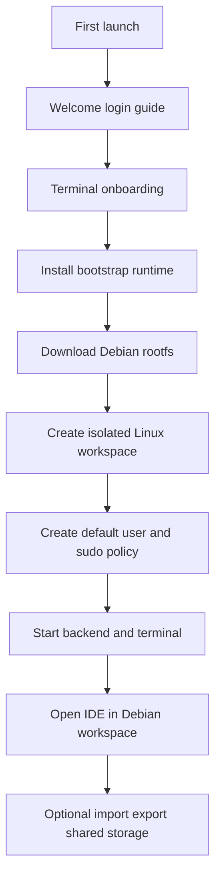

# DevPocket terminal strategy plan

## Final product decision

DevPocket will adopt a **Debian-first isolated terminal runtime**.

Core decision:
- The app remains lightweight at install time
- First launch onboarding downloads and prepares a **minimal Debian CLI rootfs**
- Terminal sessions open into Debian by default
- Users install tools such as Git, Python, Node, npm, clang, and other packages later with `apt`
- The main development workspace lives in **app-private Linux storage**, not normal shared Android storage
- Shared phone storage is treated as **import and export space**, not the primary project workspace
- A tiny hidden host bootstrap runtime remains available for repair, setup, and recovery flows

This direction is chosen because it gives the closest laptop-like IDE behavior while avoiding a heavy prebundled toolchain.

---

## Why this fixes the current terminal pain points

Current issues are strongly related to the Android-hosted environment visible in [`TheiaBackendService.kt`](android-app/android/app/src/main/java/com/theia/mobile/TheiaBackendService.kt) where the runtime is configured around external storage paths and patched shell behavior.

Likely causes of current pain:
- Git helpers and shell behavior are being patched manually in [`createProcessBuilder`](android-app/android/app/src/main/java/com/theia/mobile/TheiaBackendService.kt:129)
- Workspace root is currently external shared storage at [`/storage/emulated/0/Documents/DevPocket`](android-app/android/app/src/main/java/com/theia/mobile/TheiaBackendService.kt:139)
- Android shared storage does not behave like a normal Linux filesystem for permissions, ownership, executable bits, and some tool expectations
- Shell and runtime behavior are being adapted from the host environment instead of from a more standard Linux userland

The Debian-isolated model reduces these issues by moving the terminal toolchain and project workspace into a proper Linux-style filesystem owned by the app.

---

## Product model

### User experience goals
- App should feel like a normal mobile app on first launch
- Welcome, login, guide, and onboarding are handled in Kotlin before loading the IDE
- Onboarding prepares the terminal environment once
- After onboarding, the user lands in a Debian-based terminal and IDE workspace that feels close to a laptop setup
- Tools are not preinstalled except for the minimal runtime required to make Debian usable
- Advanced tools are installed later by the user from terminal

### Runtime model
- **User-facing runtime**: minimal Debian CLI environment
- **Hidden bootstrap runtime**: minimal host runtime used to download, extract, repair, and launch Debian
- **Primary workspace**: app-private Linux workspace
- **Shared storage role**: optional import, export, backup, and file transfer only

---

## Architecture overview

---

## Detailed implementation plan

### Phase 1 — Define runtime boundaries
1. Document the separation between:
   - Android app shell
   - hidden bootstrap runtime
   - Debian userland runtime
   - IDE backend runtime
2. Define a stable directory layout inside app-private storage for:
   - Debian rootfs
   - user home
   - projects
   - package cache
   - terminal logs
   - temporary install files
   - repair metadata
3. Decide whether the Theia backend runs:
   - inside Debian, or
   - in the host bootstrap layer with terminal shells entering Debian
4. Recommended target: move terminal shell execution and as much developer tooling as possible into Debian, while keeping Android-specific service orchestration on the Kotlin side.

### Phase 2 — Add onboarding flow on Kotlin side
1. Replace the current direct backend-first launch path in [`MainActivity.onCreate`](android-app/android/app/src/main/java/com/theia/mobile/MainActivity.kt:37) with an onboarding gate.
2. Add onboarding states:
   - first launch
   - welcome
   - login
   - guide walkthrough
   - Debian install required
   - installing
   - install failed with retry and repair
   - ready to open IDE
3. Persist onboarding completion and runtime version markers.
4. Add resumable install progress so onboarding survives app restarts.
5. Add preflight checks:
   - free storage available
   - network availability
   - battery and charging recommendation
   - corrupted previous install detection

### Phase 3 — Bootstrap runtime installer
1. Create a bootstrap installer service on Android side responsible for:
   - downloading rootfs artifacts
   - checksum verification
   - extraction
   - filesystem layout creation
   - launch script generation
   - recovery actions
2. Keep bootstrap minimal and non-user-facing.
3. Version the runtime so upgrades and repairs are deterministic.
4. Store install manifest with:
   - rootfs version
   - installer version
   - download source
   - checksum
   - migration status
5. Add rollback and reinstall support.

### Phase 4 — Debian rootfs strategy
1. Use **minimal Debian CLI** as the default downloadable rootfs.
2. Keep the initial image intentionally small.
3. Include only what is required to make a usable shell environment work reliably, such as:
   - shell essentials
   - apt
   - ca certificates
   - core utilities needed for package management and login shell startup
4. Do not preinstall developer stacks such as Node, npm, Python, Git, Java, Rust, Go, or compilers unless absolutely required for bootstrapping.
5. Decide rootfs source strategy:
   - trusted upstream Debian rootfs snapshot, or
   - DevPocket-curated minimal rootfs artifact
6. Recommended target: curated minimal artifact for reproducibility.

### Phase 5 — Filesystem and workspace model
1. Stop treating shared Android storage as the default project home.
2. Replace the external workspace assumption currently visible in [`TheiaBackendService.kt`](android-app/android/app/src/main/java/com/theia/mobile/TheiaBackendService.kt:139) with an app-private Linux workspace.
3. Proposed workspace zones:
   - `/linux/rootfs` for Debian system files
   - `/linux/home/devpocket` for user home
   - `/linux/workspaces` for active projects
   - `/shared-imports` for imported files from phone storage
   - `/exports` for user-requested export operations
4. Add explicit import and export actions in app UI instead of silent reliance on shared storage paths.
5. Define backup behavior for projects and package caches.

### Phase 6 — User account and sudo model
1. During onboarding, ask for:
   - username
   - optional display name
   - sudo behavior
2. Recommended default:
   - create a normal user such as `devpocket`
   - grant sudo access
   - allow **passwordless sudo by default** inside the isolated local Debian environment for simpler mobile UX
3. Offer advanced option during onboarding:
   - set a sudo password manually
4. Persist sudo policy choice in install metadata.
5. Support later change from settings:
   - set or change password
   - toggle passwordless sudo
   - disable sudo if desired
6. Explain clearly in onboarding that this sudo only affects the isolated Debian environment, not Android system root.

### Phase 7 — Terminal launch and shell integration
1. Add a launch contract so every terminal session starts inside Debian by default.
2. Standardize environment variables for shell startup, locale, HOME, PATH, TERM, and package cache paths.
3. Ensure terminal widgets in [`TerminalWidgetImpl`](packages/terminal/src/browser/terminal-widget-impl.ts:174) connect to Debian-backed shells instead of the current patched host-first shell flow.
4. Review backend shell resolution around [`createTerminal`](packages/terminal/src/browser/terminal-widget-impl.ts:611) and server-side creation in [`ShellTerminalServer.create`](packages/terminal/src/node/shell-terminal-server.ts:57).
5. Provide fallback entry options:
   - open normal Debian shell
   - open repair shell
   - reopen last workspace terminal

### Phase 8 — Theia backend integration strategy
1. Map how the IDE backend currently starts from [`startBackendService`](android-app/android/app/src/main/java/com/theia/mobile/MainActivity.kt:110) and [`runBackendSupervisor`](android-app/android/app/src/main/java/com/theia/mobile/TheiaBackendService.kt:81).
2. Decide backend placement model:
   - backend outside Debian with terminal sessions entering Debian, or
   - backend launched from inside Debian
3. Recommended staged rollout:
   - **Stage 1**: keep backend service orchestration on Android side, but switch terminal and workspace paths to Debian-managed paths
   - **Stage 2**: evaluate moving more backend tooling execution into Debian once base stability is proven
4. Remove environment hacks one by one as Debian becomes the real runtime source of truth.
5. Revisit current Git and shell-specific environment overrides after Debian integration.

### Phase 9 — Package management UX
1. Make terminal behavior feel laptop-like by default.
2. Use apt-based commands as the primary documented workflow.
3. Do not expose host package commands to normal users.
4. Add optional guided install shortcuts in UI for common tools, for example:
   - Git
   - Python
   - Node and npm
   - build essentials
   - OpenJDK
5. These shortcuts should run normal Debian package installs, not custom one-off installers.
6. Keep all guided installs optional.

### Phase 10 — Storage permissions and access model
1. Reduce reliance on broad all-files access if possible.
2. Prefer scoped import and export flows for interacting with normal phone storage.
3. Keep active development inside app-private Linux storage for correctness.
4. Audit whether current permission requests in [`requestStoragePermissionsIfNeeded`](android-app/android/app/src/main/java/com/theia/mobile/MainActivity.kt:67) can be narrowed after import and export flows are added.
5. Define clear file transfer UX for:
   - import project
   - export project
   - open downloaded archive
   - share file out of app

### Phase 11 — Reliability and repair flows
1. Add install-state machine with durable status markers.
2. Add health checks for:
   - rootfs presence
   - shell launch success
   - writable home directory
   - apt lock corruption
   - broken dpkg state
   - missing startup scripts
3. Add repair actions:
   - reconfigure packages
   - clear terminal cache
   - reset shell config
   - reinstall rootfs while preserving projects
   - full factory reset of Linux environment
4. Surface repair options before forcing full reinstall.

### Phase 12 — Security and trust model
1. Keep Debian isolated to app-private storage.
2. Make clear that Debian root and sudo are local to the containerized environment, not Android root.
3. Sign and verify runtime downloads.
4. Use checksum validation before extraction.
5. Avoid exposing host internals into Debian unless required.
6. Restrict shared storage mounts to user-approved paths and operations.

### Phase 13 — Performance and footprint controls
1. Keep first download small.
2. Avoid shipping heavy language runtimes in APK.
3. Add package cache cleanup controls.
4. Add disk usage visibility in settings.
5. Monitor startup time for:
   - onboarding install
   - first terminal launch
   - IDE ready time
6. Define low-storage warnings and cleanup suggestions.

### Phase 14 — Testing strategy
1. Test first-run onboarding from clean install.
2. Test interrupted install during:
   - download
   - extraction
   - user creation
   - first backend startup
3. Test terminal correctness for:
   - shell startup
   - apt update and install
   - Git clone
   - file permissions
   - executable scripts
   - SSH key generation
4. Test workspace behavior inside app-private storage versus shared storage import and export.
5. Test upgrade and repair flows on existing installs.
6. Test low-storage and no-network conditions.

### Phase 15 — Rollout order
1. Implement onboarding gate on Kotlin side.
2. Implement bootstrap installer and Debian rootfs download.
3. Move workspace root to app-private Linux storage.
4. Make terminal launch into Debian by default.
5. Add user creation and sudo onboarding options.
6. Add import and export UX for phone storage.
7. Stabilize package management and Git workflows.
8. Add repair tools and settings page.
9. Reassess whether backend execution should move deeper into Debian.

---

## Decisions locked for implementation

### Locked
- Debian-first runtime
- app-private Linux workspace as default
- apt-based user experience
- onboarding-driven runtime installation
- no heavy preinstalled developer packages
- shared storage used for import and export only
- hidden bootstrap runtime retained for setup and recovery

### Needs explicit implementation choice
- whether default sudo is passwordless or password-protected
- whether backend remains partly outside Debian in stage 1
- exact Debian rootfs source and update channel
- whether Git should remain absent from base image or be included as a tiny convenience package

---

## Recommendation on sudo onboarding

Recommended mobile-first default:
- create user `devpocket`
- enable sudo
- default to passwordless sudo inside the isolated Debian environment
- show an advanced onboarding option to set a sudo password instead
- allow changing this later from settings

Reason:
- easiest UX for phone users
- closest to seamless IDE experience
- still safe enough inside an isolated app-private Debian environment compared with real device root

If stricter realism is preferred later, password-based sudo can become the recommended advanced mode.

---

## Immediate next implementation slice

The first implementation slice should focus on:
1. onboarding gate before IDE launch
2. bootstrap installer service
3. Debian rootfs install into app-private storage
4. default Linux workspace creation
5. Debian shell launch proof of concept through existing terminal UI
6. sudo onboarding choice

This slice is enough to validate the core product direction before deeper terminal refactors.
